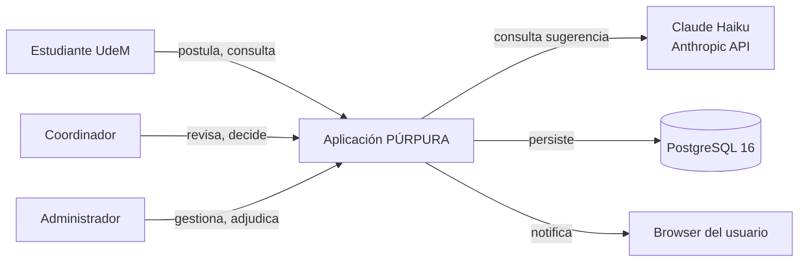
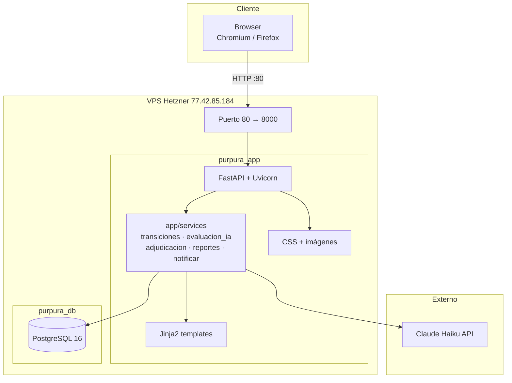
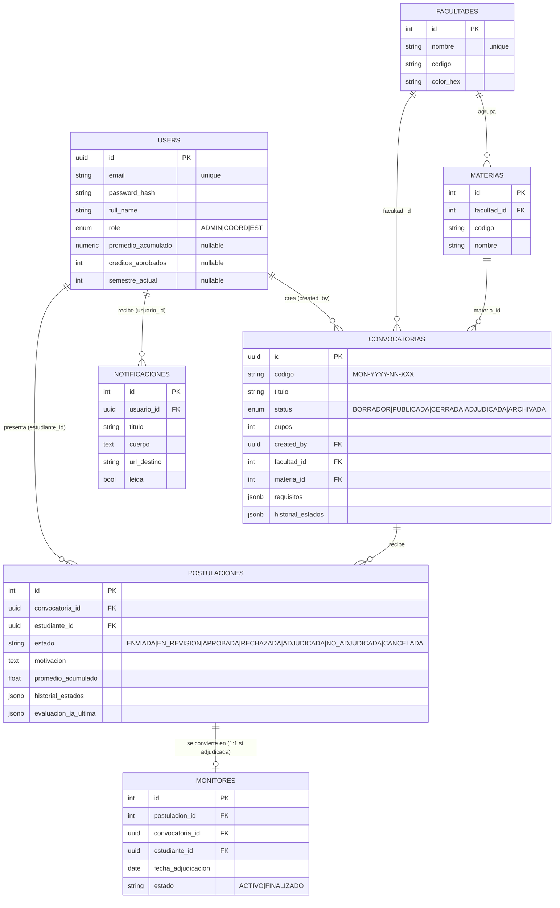
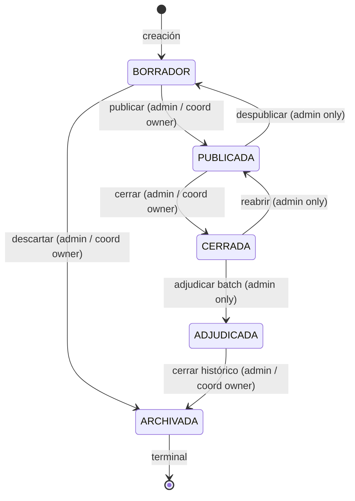
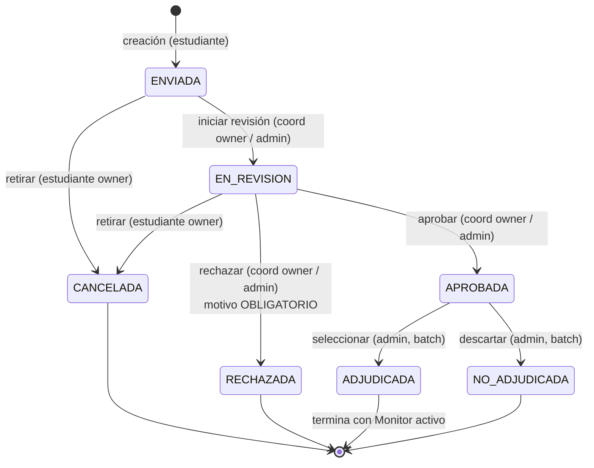

# Universidad de Medellín — Proyecto PÚRPURA
## Sistema de Gestión de Monitorías Académicas — Release 1
### Diseño de Software · Semestre 2026-1

---

**Equipo**
- Felipe Cano — Product Owner / UX-UI
- José Carlos Jiménez — Backend
- Santiago Torres Gallego — Tech Lead / Data Engineering
- Sebastián Rendón — Frontend

**Fecha de entrega**: 30 de mayo de 2026
**Producción**: http://77.42.85.184
**Repositorio**: https://github.com/satorresga/purpura
**Tag**: `v1.0.0-release1`

---

## Tabla de contenidos

1. [Contexto del proyecto](#1-contexto)
2. [Arquitectura técnica](#2-arquitectura-tecnica)
3. [Modelo de dominio](#3-modelo-de-dominio)
4. [Máquinas de estado](#4-maquinas-de-estado)
5. [Capa IA híbrida](#5-capa-ia-hibrida)
6. [Roles y permisos](#6-roles-y-permisos)
7. [Test suite](#7-test-suite)
8. [Producción](#8-produccion)
9. [Decisiones de diseño defendibles](#9-decisiones-de-diseno-defendibles)
10. [Roadmap R2](#10-roadmap-r2)

Apéndices: credenciales de demo, comandos CLI, créditos.

---

## 1. Contexto

PÚRPURA es un sistema institucional para la gestión integral del programa de
monitorías académicas de la Universidad de Medellín. Centraliza el ciclo
completo del proceso: publicación de convocatorias por parte de coordinación,
postulación de estudiantes con asesoría algorítmica, decisión humana del
coordinador, adjudicación final por administración, y seguimiento de los
monitores activos.

### Alcance del Release 1 (entregable)

- **Trilogía institucional pública**: landing, login con tabs de rol, documentación.
- **CRUD completo de convocatorias** con máquina de estados explícita.
- **Flujo del estudiante**: postular, ver postulaciones, cancelar.
- **Bandeja del coordinador**: revisar, transicionar a EN_REVISION, agregar notas privadas.
- **Capa IA híbrida**: reglas determinísticas para datos completos + Claude Haiku para datos incompletos + fallback resiliente.
- **Decisión final**: aprobar/rechazar con motivo, adjudicación batch atómica.
- **Notificaciones**: campana en navbar con dropdown server-rendered, pantalla `/notificaciones`, triggers en cada cambio de estado relevante.
- **Reportes con métricas + CSV** para análisis externo.
- **Identidad gráfica UdeM** según paleta Figma del equipo + logo oficial.
- **56 chequeos automáticos verde** con Playwright en cada commit.

### Fuera de alcance R1 (R2 / posterior)

- Recuperación de contraseña y auto-registro.
- Páginas institucionales adicionales (Nuestra U, Campus, Reglamento completo).
- Integración con el sistema académico real (datos de promedio/créditos automáticos).
- Histórico de monitorías finalizadas + evaluación de desempeño.
- Notificaciones por email/WhatsApp.
- Dashboard con gráficos.
- API JSON para terceros.

---

## 2. Arquitectura técnica

### Stack tecnológico

| Capa | Tecnología | Versión |
|---|---|---|
| Backend | FastAPI síncrono | 0.136.1 |
| ORM | SQLModel | 0.0.38 |
| Base de datos | PostgreSQL | 16 |
| Driver | psycopg | 3.3.4 |
| Templates | Jinja2 | 3.1 |
| Frontend | Bootstrap 5.3 + Alpine.js puntual | CDN |
| Auth | bcrypt + Starlette SessionMiddleware | 5.0 |
| Containers | Docker Compose | v5 |
| IA | Anthropic Claude Haiku | `claude-haiku-4-5-20251001` |
| Tests | Playwright (E2E) | 1.59 |
| Build | uv | 0.11.6 |
| Python | CPython | 3.12 |

### Diagrama de contexto



### Diagrama de componentes



---

## 3. Modelo de dominio

### Diagrama ER



### Tablas

| Tabla | Filas seed | Notas |
|---|---|---|
| `users` | 9 (1 admin, 3 coord, 2 docentes, 3 estudiantes) | estudiante1/2 tienen datos académicos; estudiante3 NULL para forzar rama LLM |
| `facultades` | 7 oficiales UdeM con `color_hex` |
| `materias` | 12 (ISI-301, ISI-405, DER-101, MAT-201, PSI-301, etc.) |
| `convocatorias` | 7 (2 legacy Sprint 1 + 5 R1) | 2 PUBLICADAS (ISI301, ISI405) |
| `postulaciones` | 6 demo |
| `monitores` | 0 inicial; se crean al adjudicar |
| `notificaciones` | dinámicas; se crean por triggers |
| `audit_log` | append-only, registra LOGIN/LOGOUT/CREATE/TRANSICION/POSTULAR/ADJUDICAR/etc |

### Migraciones sin Alembic

`run_migrations()` en `app/db.py` corre al startup. Aplica `ALTER TABLE IF NOT EXISTS` + `CREATE UNIQUE INDEX IF NOT EXISTS` idempotentes:

- Columnas añadidas progresivamente: `convocatorias.{facultad_id, materia_id, semestre, historial_estados}`, `postulaciones.{historial_estados, evaluacion_ia_ultima}`, `users.{promedio_acumulado, creditos_aprobados, semestre_actual}`.
- Índice partial: `uq_postulacion_activa ON postulaciones (convocatoria_id, estudiante_id) WHERE estado != 'CANCELADA'`. Permite re-postular tras cancelar.
- Índice de performance: `ix_notificaciones_usuario_leida ON notificaciones (usuario_id, leida)`.
- Enum `ConvocatoriaStatus` extendido con `ADJUDICADA` vía `ALTER TYPE ... ADD VALUE IF NOT EXISTS` (con AUTOCOMMIT por compatibilidad).

---

## 4. Máquinas de estado

### Convocatoria



Implementación: `app/services/transiciones.py::transicionar_estado()` valida cada arista contra el dict `TRANSICIONES` + perfiles `("admin", "coord_owner")`. Lanza `TransicionInvalidaError` o `PermisoInsuficienteError`.

### Postulación



Implementación: `app/services/transiciones.py::transicionar_postulacion()` con perfiles `("estudiante_owner", "coord_conv_owner", "admin")`.

---

## 5. Capa IA híbrida

### Flujo de decisión

```mermaid
flowchart TD
  start([Estudiante postula<br/>o coord pasa a EN_REVISION]) --> chk{User tiene<br/>los 3 campos académicos<br/>no-NULL?}
  chk -->|Sí| reglas[Modo REGLAS<br/>determinísticas]
  chk -->|No| llm[Modo LLM<br/>Claude Haiku]
  llm --> apikey{ANTHROPIC_API_KEY<br/>configurada?}
  apikey -->|No| fallback[Modo FALLBACK<br/>REVISAR_MANUAL]
  apikey -->|Sí| call[Llamada API<br/>timeout 10s]
  call --> ok{Respuesta válida?}
  ok -->|Sí| resp[decision_sugerida<br/>AUTO_APTO|AUTO_NO_APTO|REVISAR_MANUAL]
  ok -->|Timeout/Error| fallback
  reglas --> save[(Persistir en<br/>evaluacion_ia_ultima<br/>+ historial_estados)]
  resp --> save
  fallback --> save
```

### Prompt enviado a Claude Haiku

**System** (constant):

> Eres un asistente de validación académica del programa de monitorías de la Universidad de Medellín. Recibes datos de una postulación a una convocatoria y debes sugerir si el estudiante es APTO, NO_APTO, o si requiere REVISAR_MANUAL.
>
> Reglas:
> - Si el estudiante claramente cumple los requisitos publicados → APTO.
> - Si claramente no los cumple → NO_APTO.
> - Si los datos son insuficientes o ambiguos → REVISAR_MANUAL.
> - Nunca decides 'aprobar' o 'rechazar' — solo sugieres. El coordinador toma la decisión final.
>
> Responde ÚNICAMENTE con JSON válido, sin markdown ni texto extra:
> `{"decision": "APTO"|"NO_APTO"|"REVISAR_MANUAL", "confianza": 0.0-1.0, "justificacion": "..."}`

**User** (template por postulación):

```
Convocatoria: {titulo}
Código: {codigo}
Facultad: {facultad}
Asignatura/materia: {materia}
Requisitos publicados:
{json de requisitos}

Estudiante:
- Email: {email}
- Nombre: {full_name}
- Promedio acumulado: {promedio o "no registrado"}
- Créditos aprobados: {créditos o "no registrado"}
- Semestre actual: {semestre o "no registrado"}

Motivación del estudiante:
{motivacion}

Evalúa según las reglas y responde JSON.
```

Parámetros: `model=claude-haiku-4-5-20251001`, `max_tokens=300`, `temperature=0.2`, `timeout=10s`.

### Ejemplos de output real (postulaciones de producción)

**Modo reglas** (estudiante1 con promedio 4.5, créditos 80, semestre 6, ISI301 requiere promedio ≥ 4.0):
```json
{
  "modo": "reglas",
  "modelo": "reglas-v1",
  "decision_sugerida": "AUTO_APTO",
  "confianza": 1.0,
  "justificacion": "Cumple los requisitos automáticos: promedio_minimo 4.5 >= 4.0.",
  "checks": [
    {"regla": "promedio_minimo", "esperado": ">= 4.0", "actual": 4.5, "ok": true}
  ]
}
```

**Modo LLM** (estudiante3 con todos los campos NULL):
```json
{
  "modo": "llm",
  "modelo": "claude-haiku-4-5-20251001",
  "decision_sugerida": "REVISAR_MANUAL",
  "confianza": 0.5,
  "justificacion": "Datos insuficientes: promedio acumulado no registrado, créditos aprobados no disponibles, semestre actual desconocido. No se puede verificar si aprobó ISI-301 con nota ≥4.0 ni disponibilidad de 8 horas. Requiere validación manual en sistema académico.",
  "tokens_in": 505,
  "tokens_out": 123
}
```

**Modo fallback** (API down o key faltante):
```json
{
  "modo": "fallback",
  "modelo": "fallback",
  "decision_sugerida": "REVISAR_MANUAL",
  "confianza": 0.0,
  "justificacion": "Evaluación automática no disponible (RuntimeError). Se requiere revisión manual."
}
```

### Disclaimer ético (obligatorio en UI)

> **Disclaimer:** Esta es una sugerencia algorítmica. La decisión final corresponde al coordinador o administrador.

Implementado en `app/templates/postulacion_detalle.html` dentro de cada card `.card-evaluacion-ia`. **Human-in-the-loop por diseño**: la IA nunca decide, solo sugiere.

---

## 6. Roles y permisos

| Endpoint / Acción | Estudiante | Coord owner | Coord no-owner | Admin |
|---|---|---|---|---|
| `GET /convocatorias` | filtra a PUBLICADAs | sus + no archivadas | no archivadas | todas excepto archivadas |
| `GET /convocatorias/{id}` | sí (con bloque estudiante) | sí | sí | sí |
| `POST /convocatorias/crear` | 403 | 403 | sí | sí |
| `GET /convocatorias/{id}/editar` (solo BORRADOR) | 403 | sí | 403 | sí |
| `POST /convocatorias/{id}/transicionar PUBLICADA→BORRADOR` | 403 | 403 | 403 | sí (admin only) |
| `POST /convocatorias/{id}/transicionar BORRADOR→PUBLICADA` | 403 | 403 | sí | sí |
| `POST /convocatorias/{id}/postular` | sí (si PUBLICADA y sin activa) | 403 | 403 | 403 |
| `GET /mis-postulaciones` | sí | 403 | 403 | 403 |
| `POST /postulaciones/{id}/cancelar` | sí (si dueño + activa) | 403 | 403 | 403 |
| `GET /bandeja` | 403 | sus | 0 filas | todas |
| `GET /postulaciones/{id}` | 403 | sí (sus convs) | 403 | sí |
| `POST /postulaciones/{id}/transicionar APROBADA` | 403 | sí | 403 | sí |
| `POST /postulaciones/{id}/transicionar RECHAZADA` (motivo obligatorio) | 403 | sí | 403 | sí |
| `POST /postulaciones/{id}/nota` | 403 (privada) | sí | 403 | sí |
| `GET /convocatorias/{id}/adjudicar` | 403 | 403 | 403 | sí (admin only) |
| `POST /convocatorias/{id}/adjudicar` (batch atómico) | 403 | 403 | 403 | sí (admin only) |
| `GET /mis-monitorias` | sí | 403 | 403 | 403 |
| `GET /reportes` | 403 | sus datos | sus datos (0 filas) | todos |
| `GET /reportes/csv/*` | 403 | sus datos | sus datos | todos |
| `GET /perfil` | sí | 403 | 403 | 403 |
| `GET /notificaciones` | sí (sus) | sí (sus) | sí (sus) | sí (sus) |
| `GET /documentacion` | público | público | público | público |
| `GET /` (landing) | redirect a /dashboard | redirect | redirect | redirect |

---

## 7. Test suite

**56 escenarios automatizados** con Playwright headed (slow_mo 350ms). Corre contra local (`http://localhost:8000`) y contra producción via túnel SSH (`http://127.0.0.1:8080 → VPS:80`).

### Cobertura por escenario

| Rango | Escenario | Qué valida |
|---|---|---|
| V01–V06 | Login institucional | logo color, borde rojo card, Roboto body, Vigilada MinEducación |
| V07–V10 | Dashboard admin | navbar borde gris fino, RBAC links, badge admin, footer negro |
| V11–V14 | Listado convocatorias | tabla thead azul Figma, 5+ chips facultad, badges estado |
| V15–V17 | Dashboard estudiante (RBAC) | no ve Reportes/Panel, ve Convocatorias/Mis postulaciones/Mis monitorías |
| V18 | Footer | créditos del equipo |
| V19–V21 | Logo oficial UdeM | color en navbar/login, blanco en footer |
| V22–V27 | Landing pública + login tabs | hero gradient, 4 stats, 3 perfiles, FAQ, tab coord rojo |
| V28–V29 | Documentación pública | hero + 6 cards |
| V30–V33 | CRUD convocatorias + transiciones | detalle admin, RBAC estudiante, transición inválida rechazada, archivadas |
| V34–V37 | Flujo estudiante | postular, mis-postulaciones, sin duplicar, cancelar |
| V38–V41 | Bandeja coord | bandeja con filas, estudiante bloqueado, transición EN_REVISION, nota privada |
| V42–V44 | Capa IA | card en detalle, columna en bandeja, filtro ?ia=revisar |
| V45–V48 | Adjudicación batch | aprobar, rechazar (motivo obligatorio), form adjudicar, ADJUDICADA atómico |
| V49–V50 | Bifurcación IA por datos del User | datos completos → reglas; datos NULL → LLM |
| V51–V53 | Notificaciones | mis-monitorías, campana visible, marcar leída |
| V54–V56 | Reportes + CSV + ACL | 4 KPIs + tablas, CSV con BOM, coord ve filtrado |

### Veredictos históricos

| Commit | Local | Remoto (vía túnel SSH) |
|---|---|---|
| `d203d4b` (P01) | 18/18 ✓ | 18/18 ✓ |
| `6e1becf` (P01-VALIDATE) | 18/18 ✓ | 18/18 ✓ |
| `483da6a` (P01-LOGO smoke) | 21/21 ✓ | 21/21 ✓ |
| `b763c4c` (P01.5a) | 21/21 ✓ | 21/21 ✓ |
| `f57d53e` (P01.5b) | 27/27 ✓ | 27/27 ✓ |
| `caaf567` (P01.5c) | 29/29 ✓ | 29/29 ✓ |
| `875c4d8` (P01.5d) | 29/29 ✓ | 29/29 ✓ |
| `b8d5adc` (P02) | 33/33 ✓ | 33/33 ✓ |
| `8427e66` (P03) | 37/37 ✓ | 37/37 ✓ |
| `c342925` (P04) | 41/41 ✓ | 41/41 ✓ |
| `706ec7d` + fix (P05 + VERIFY) | 44/44 ✓ | 44/44 ✓ |
| `cbc78f3` (P06) | 48/48 ✓ | 48/48 ✓ |
| `c0c3465` (P05.5) | 50/50 ✓ | 50/50 ✓ |
| `b2f08b6` (P07) | 53/53 ✓ | 53/53 ✓ |
| **`4aa217c` (P08)** | **56/56 ✓** | **56/56 ✓** |

---

## 8. Producción

### Infraestructura

| Recurso | Detalle |
|---|---|
| Host | Hetzner VPS (Ubuntu 24.04, 2 GB RAM, 2 vCPU) |
| IP pública | 77.42.85.184 |
| Acceso | SSH key-based (alias `purpura`) |
| Firewall | ufw: 22 (SSH) + 80 (HTTP) abiertos. PostgreSQL no expuesto al host |
| Swap | 2 GB swapfile habilitado |
| Container app | `purpura_app` (FastAPI + uvicorn 2 workers, non-root user) |
| Container db | `purpura_db` (postgres:16-alpine, volumen nombrado `purpura_db_data`) |
| Build | Multi-stage Dockerfile con `uv sync --frozen --no-dev` |

### Deploy pipeline manual

```bash
# Local
git push origin main

# VPS
ssh purpura
cd /srv/purpura
git pull
docker compose -f deploy/docker-compose.yml up -d --build app
docker compose -f deploy/docker-compose.yml logs --tail=20 app
```

### Smoke remoto post-deploy

```bash
# Túnel SSH local 8080 → VPS:80 (evita interferencia de antivirus local)
ssh -L 8080:127.0.0.1:80 purpura -N -f
BASE_URL=http://127.0.0.1:8080 uv run python tests/visual_validation.py
```

### Configuración sensible

`.env` del VPS en `/srv/purpura/deploy/.env` (NO en raíz; el `docker-compose.yml` lo lee desde el dir del compose file):

```
POSTGRES_DB=purpura
POSTGRES_USER=purpura
POSTGRES_PASSWORD=<random_32_chars>
SESSION_SECRET_KEY=<secrets.token_urlsafe(48)>
ANTHROPIC_API_KEY=sk-ant-api03-...
```

El compose mapea `ANTHROPIC_API_KEY: ${ANTHROPIC_API_KEY:-}` con default vacío para que el container arranque incluso sin la key (modo fallback activo).

---

## 9. Decisiones de diseño defendibles

1. **Máquinas de estado explícitas (`TRANSICIONES_*` dicts) en lugar de if/elif diseminados.** Cualquier transición prohibida lanza `TransicionInvalidaError`. Tests directos sobre el dict garantizan correctitud sin acoplar a la UI.

2. **Capa IA híbrida con fallback resiliente.** El sistema nunca rompe por fallo de la IA externa: timeout, rate limit, API key faltante, JSON inválido — todos caen en `REVISAR_MANUAL` con justificación textual. La operación principal (crear/transicionar postulación) sigue su curso.

3. **Human-in-the-loop por arquitectura.** El LLM responde con campo `decision_sugerida`, no `decision`. UI usa lenguaje "sugerencia / asesoría / recomendación". Disclaimer obligatorio en el detalle. La IA es input, el coord es decisor.

4. **Soft delete vía estado ARCHIVADA** en lugar de `DELETE FROM convocatorias`. El audit trail se preserva, las analíticas históricas son posibles, y la convocatoria sigue accesible para auditoría.

5. **Migración declarativa en startup, sin Alembic.** `run_migrations()` aplica `ALTER TABLE IF NOT EXISTS` + `CREATE INDEX IF NOT EXISTS` idempotentes en cada arranque. Trade-off explícito: no se trackea historial de schema, pero R1 no lo necesita. R2 puede introducir Alembic cuando el equipo crezca.

6. **Tests E2E sobre tests unitarios.** Cubre flujos reales del usuario (login, postular, aprobar, adjudicar), no implementación interna. Más mantenible a esta escala con un equipo de 4 personas.

7. **CSVs con BOM UTF-8 y separador `;`** para que Excel español los abra con acentos correctos. Pequeño detalle, mucha diferencia operativa.

8. **`historial_estados` JSONB en convocatorias y postulaciones.** Audit log queryable, exportable a CSV, base para reportes futuros. Cada transición appendea un evento `{from, to, by_user_id, by_email, motivo, at}`.

9. **Tabs de rol en login 100% cosméticos.** La autorización real viene de la BD vía `request.session.rol`. El cliente puede enviar cualquier `rol_preferido`; el backend lo descarta. Defensa en profundidad: nunca confiar en input del usuario.

10. **Atomicidad en adjudicación batch.** `app/services/adjudicacion.py::adjudicar_convocatoria()` muta objetos en memoria; el router persiste todo en una sola transacción. Si falla a la mitad, rollback completo. Sin estados intermedios.

11. **Bifurcación reglas/LLM STRICT por completitud del User.** Si falta uno de los 3 campos académicos, el sistema NO intenta validar parcialmente — invoca al LLM. Evita validaciones engañosas (ej: "aprobado por promedio" sin verificar créditos).

12. **Partial unique index** `WHERE estado != 'CANCELADA'` sobre `postulaciones (convocatoria_id, estudiante_id)`. Garantiza una sola postulación activa por par estudiante-convocatoria, pero permite re-postular tras cancelar. La regla de negocio se hace cumplir a nivel de BD.

13. **Notificaciones server-rendered con `<details>` HTML nativo.** Cero JS para el dropdown de la campana. Accesible, funciona en todos los navegadores, costo: una query extra por request del usuario logueado (cubierta por índice).

14. **Logo institucional como SVG oficial con script generador de variantes.** `scripts/generate_logo_variants.py` extrae el PNG embebido del SVG de Figma y produce 3 variantes (color, blanco, sobre-rojo) con alpha mask derivado. Reproducible.

15. **Identidad gráfica del Figma del equipo en lugar del manual oficial UdeM 2022.** Decisión defendible: el manual es para piezas físicas; el contexto digital permite adaptaciones del equipo (paleta `#C8202D` + footer negro + tipografías Open Sans/Roboto). Documentado en CSS variables centralizadas.

---

## 10. Roadmap R2

### Funcional
- **Recuperar contraseña** vía email + token con expiración.
- **Auto-registro** para estudiantes con verificación de correo institucional.
- **Histórico de monitorías** finalizadas + evaluación de desempeño del monitor por el docente tutor.
- **Filtros avanzados** en bandeja y reportes (por estado IA, por semestre, por rango de fechas).
- **Comentarios entre coord y admin** sobre una postulación (chat embebido en el detalle).

### Integraciones
- **Sistema académico real UdeM** para llenar promedio/créditos/semestre automáticamente al ingresar (en lugar del form `/perfil`).
- **Email transaccional** (SendGrid o similar) para que las notificaciones críticas también lleguen al buzón.
- **WhatsApp Business API** opcional para notificaciones móviles.

### Infraestructura
- **HTTPS con Caddy o nginx + Let's Encrypt.** Permite reactivar `SESSION_COOKIE_SECURE=true`.
- **Alembic** para migraciones formales con historial trackeable.
- **CI/CD** con GitHub Actions: tests automatizados en cada PR, deploy automático a VPS al merge en main.
- **Backups automatizados** de PostgreSQL al storage Hetzner.

### UX
- **Dashboard con gráficos** (Chart.js): postulaciones por semana, tasa de adjudicación por facultad, etc.
- **Notificaciones in-app en tiempo real** (Server-Sent Events o WebSocket).
- **Búsqueda full-text** en convocatorias.

### Seguridad / cumplimiento
- **Roles más granulares**: coordinador por facultad, vicerrector, decano.
- **Auditoría exportable** (CSV completo del `audit_log`).
- **GDPR-like**: derecho al olvido del estudiante (anonimización en lugar de hard delete).

---

## Apéndice A — Credenciales de demo

| Email | Password | Rol | Datos académicos | Notas |
|---|---|---|---|---|
| `admin@purpura.local` | `Admin2026!` | administrador | n/a | Único admin del sistema |
| `coord.ing@udem.edu.co` | `Coord2026!` | coordinador | n/a | Owner de ISI301, ISI405 |
| `coord.com@udem.edu.co` | `Coord2026!` | coordinador | n/a | Comunicaciones |
| `coord.der@udem.edu.co` | `Coord2026!` | coordinador | n/a | Derecho — owner DER101 |
| `docente1@udem.edu.co` | `Docente2026!` | docente | n/a | Reservado para R2 |
| `docente2@udem.edu.co` | `Docente2026!` | docente | n/a | Reservado para R2 |
| `estudiante1@udem.edu.co` | `Estudiante2026!` | estudiante | promedio 4.5 / créd 80 / sem 6 | **Demuestra modo reglas** |
| `estudiante2@udem.edu.co` | `Estudiante2026!` | estudiante | promedio 3.2 / créd 60 / sem 5 | Modo reglas → AUTO_NO_APTO |
| `estudiante3@udem.edu.co` | `Estudiante2026!` | estudiante | NULL / NULL / NULL | **Demuestra modo LLM** |

---

## Apéndice B — Comandos CLI útiles

```bash
# Levantar local
uv sync
uv run uvicorn app.main:app --reload

# Seed (idempotente)
uv run seed

# Smoke completo (56 escenarios)
uv run python tests/visual_validation.py

# Smoke end-to-end narrativo (cierra el ciclo en una corrida)
uv run python tests/e2e_release1.py

# Generar variantes del logosímbolo desde el SVG oficial
uv run python scripts/generate_logo_variants.py

# Generar PDF de entrega
uv run python scripts/generate_release_pdf.py

# Deploy a VPS
ssh purpura "cd /srv/purpura && git pull && docker compose -f deploy/docker-compose.yml up -d --build app"

# Smoke remoto via túnel SSH
ssh -L 8080:127.0.0.1:80 purpura -N -f
BASE_URL=http://127.0.0.1:8080 uv run python tests/visual_validation.py
```

---

## Apéndice C — Créditos

**Equipo PÚRPURA**, Universidad de Medellín, semestre 2026-1:

- **Felipe Cano** — Product Owner, diseño UX/UI, Figma del equipo (paleta institucional + componentes), guiones de sustentación.
- **José Carlos Jiménez** — Backend Python: services de transiciones, adjudicación, evaluación IA. Integración Anthropic SDK.
- **Santiago Torres Gallego** — Tech Lead, data engineering, infraestructura. Modelo de datos, migraciones, deploy VPS, smoke E2E con Playwright.
- **Sebastián Rendón** — Frontend SSR: templates Jinja2, CSS Figma, identidad gráfica UdeM, accesibilidad.

Asistencia técnica: **Claude Code** (Anthropic) para pair programming en backend, servicios, templates y validación automatizada. Cada commit lleva `Co-Authored-By: Claude Opus 4.7`.

---

*Documento generado automáticamente desde `docs/entrega/entrega_release1.md` con `scripts/generate_release_pdf.py`.*

*Universidad de Medellín · Ciencia y Libertad · Vigilada MinEducación · Desde 1950.*
